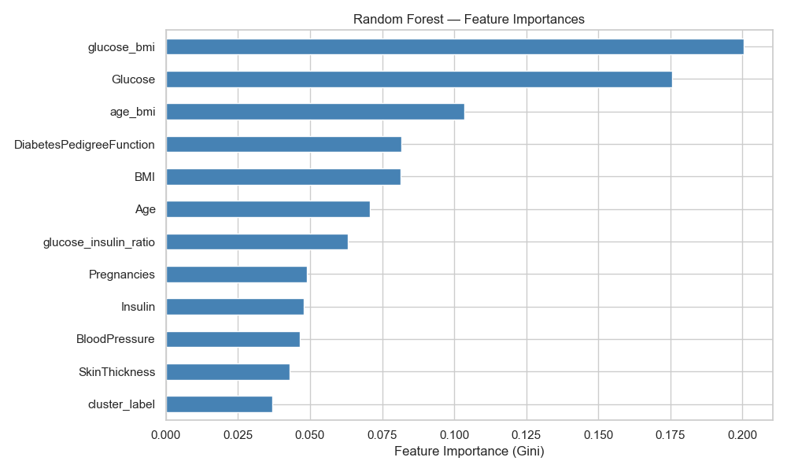

# Diabetes Prediction — ML Pipeline

A complete machine learning pipeline predicting diabetes onset in female patients of Pima Indian heritage, built as a final project for the Introduction to Machine Learning course (2025).

## Dataset

**Name:** Pima Indians Diabetes Database  
**Source:** https://www.kaggle.com/datasets/uciml/pima-indians-diabetes-database  
**License:** CC0: Public Domain  
**Size:** 768 rows × 9 columns (8 features + 1 binary target)

## Project Structure
```text
ml-diabetes-project/
├── data/
│   ├── raw/              # Original downloaded dataset
│   ├── cleaned.csv       # Output of T1: cleaned data
│   └── clustered.csv     # Output of T3: data with cluster labels
├── notebooks/
│   ├── T1_EDA.ipynb
│   ├── T2_Supervised.ipynb
│   ├── T3_Unsupervised.ipynb
│   └── T4_Ensemble.ipynb
├── models/
│   └── supervised_best.pkl
├── reports/              # All exported figures and tables
├── requirements.txt
└── README.md

## Installation and Usage

**1. Clone the repository:**
```bash
git clone https://github.com/Baxter6458/ml-diabetes-project.git
cd ml-diabetes-project
```

**2. Create virtual environment and install dependencies:**
```bash
python -m venv venv
venv\Scripts\activate        # Windows
source venv/bin/activate     # Mac/Linux
pip install -r requirements.txt
```

**3. Run notebooks in order:**
```text
notebooks/T1_EDA.ipynb
notebooks/T2_Supervised.ipynb
notebooks/T3_Unsupervised.ipynb
notebooks/T4_Ensemble.ipynb

Each notebook reads from and writes to the `data/` folder automatically.

## Final Model Results

| Model | Accuracy | Precision | Recall | F1 |
|---|---|---|---|---|
| Logistic Regression (baseline) | 0.6948 | 0.5778 | 0.4815 | 0.5253 |
| Decision Tree | 0.7078 | 0.5918 | 0.5370 | 0.5631 |
| Random Forest | 0.7143 | 0.6042 | 0.5370 | 0.5686 |
| **Gradient Boosting** | **0.7597** | **0.6809** | **0.5926** | **0.6337** |

Gradient Boosting achieves the best performance across all metrics, improving F1 by 10.9 percentage points over the Logistic Regression baseline.

## Key Findings

- **Glucose** is the strongest single predictor of diabetes onset
- **Engineered features** (glucose_bmi, glucose_insulin_ratio) rank among top importances
- **Clustering** revealed 3 patient subgroups: Young Low-Risk, Middle Metabolic Risk, Older High-Risk
- **Ensemble methods** consistently outperform single models on this dataset

## Figure: Feature Importances

